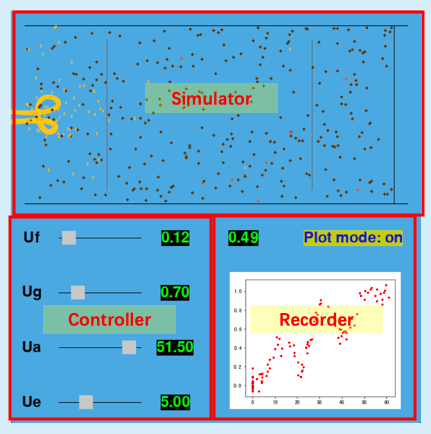

## Animation of Frank-Hertz Experiment

#### Requirements

- python3
- pygame
- matplotlib

#### How to Run?

```bash
python3 main.py
```

#### Interface



- Controller: using scrollbars to control voltages

- Simulator: simulate the physical process in Frank-Hertz tube

  - brown points: atoms (will turn orange when stimulated)
  - yellow points: electron

- Recorder: record averaged arriving electrons -> current

  

